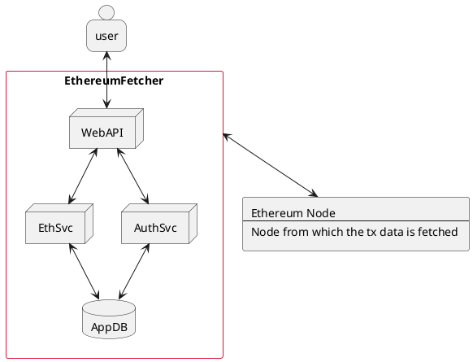

# EthereumFetcher

EthereumFetcher is an app that fetches transaction data from a given ethereum node. The app provides:
 * DB caching of previously requested transaction data
 * Previous user transaction request data. Authorization is required.

 In the diagram below, I will try to visually describe the application structure as simply as possible (only container level view of the system).

## Container

